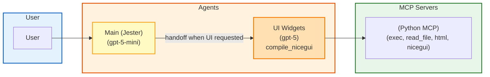

# Jokes + UI Components Assistant

## Overview
A simple agentic system with a main agent that tells jokes and a specialist that generates interactive UI components using NiceGUI. The main agent routes UI requests to the UI Widgets agent.

- Project name: `jokes-ui-assistant`
- Default agent: Main (Jester)
- MCP servers: Python MCP (for NiceGUI compilation, file I/O, HTML/iframe output)

## Agents
- Main (Jester) — Tells jokes directly; detects UI requests and delegates to UI Widgets.
- UI Widgets — Generates NiceGUI components and displays them via an iframe.

## Models
- Main: openai/responses/gpt-5-mini (fast routing and jokes)
- UI Widgets: openai/responses/gpt-5 (stronger code generation)

## MCP Servers
- Python MCP: execute_python_code, read/write files, install packages, generate HTML, compile NiceGUI widgets

## Handoff Logic
- If the user asks for UI components (widgets, forms, tables, dashboards), Main hands off to UI Widgets.
- Otherwise, Main responds directly with jokes.

## Mermaid Architecture Diagram

## Usage
- Tell jokes: "Tell me a tech pun" or "Give me 3 dad jokes about coffee".
- Generate UI: "Create a small NiceGUI with a button and a counter", "Build a form with a dropdown and a table".
